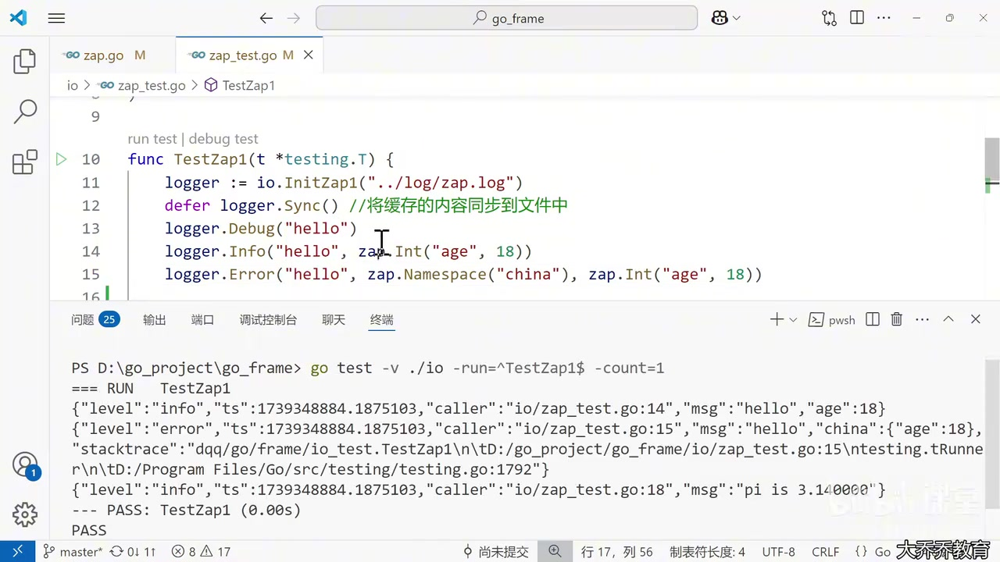
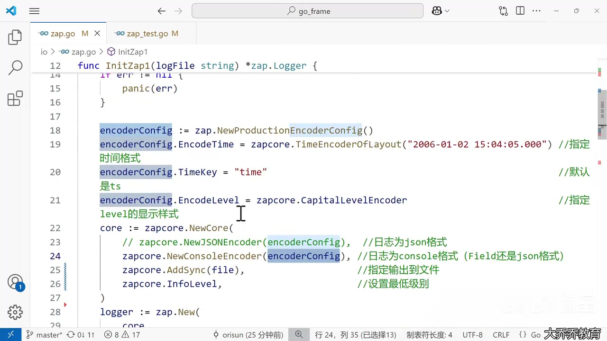
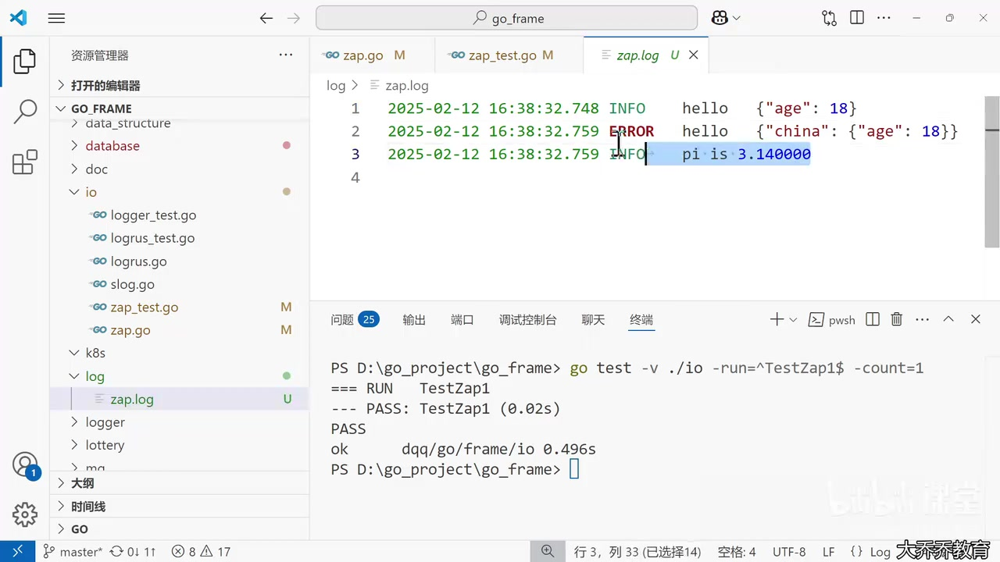
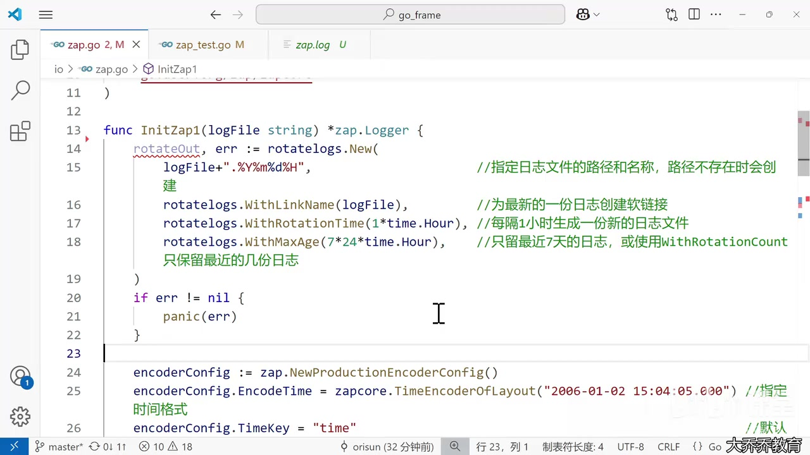
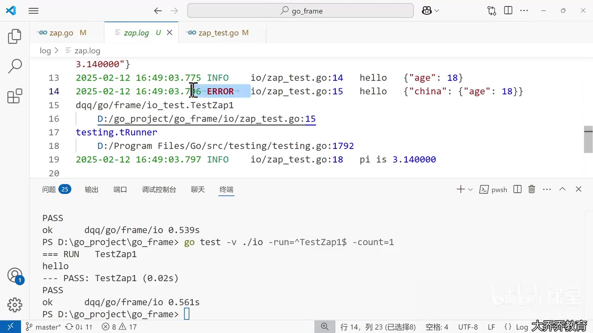
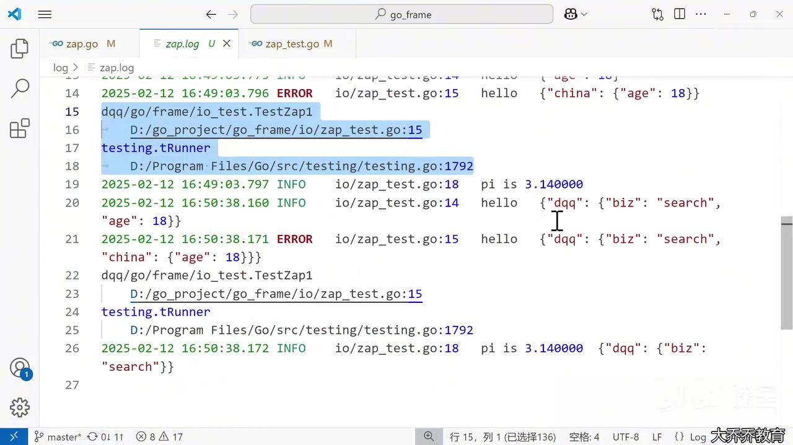

# 第 168 课：Go Zap Logger

> 中文课堂式完整笔记
> 视频时长：13:31
> 资料来源：完整 AI 字幕、81 张去重画面、`resources/zap.go` 与 `resources/zap_test.go`
> 原则：技术标识符以屏幕代码和资源文件为准，字幕中的“zip”“call”等均校正为 Zap、Core。

## 0. 这节课解决什么问题

`fmt.Println` 和标准库 `log` 可以输出文字，但正式后端项目通常还需要：

- 按 `Debug / Info / Warn / Error` 等级过滤日志；
- 用明确类型记录结构化字段，便于检索与聚合；
- 选择 JSON 或控制台格式；
- 自动记录调用文件、行号与错误调用栈；
- 同时输出到终端和文件；
- 定期切割文件并清理旧日志；
- 从配置字符串动态决定最低日志级别；
- 为所有日志附加服务、业务或请求上下文。

本课的核心公式是：

```text
Logger = Core + Options
Core   = Encoder + WriteSyncer + LevelEnabler
```

## 1. 视频路线图

| 时间        | 内容                                                    |
| ----------- | ------------------------------------------------------- |
| 00:00–00:55 | Zap 的三种内置 Logger                                   |
| 00:55–03:24 | 运行测试、级别过滤、类型化 Field、Namespace、Stacktrace |
| 03:24–04:11 | `Logger` 与 `SugaredLogger`                             |
| 04:11–06:24 | 自定义 `Core`、Encoder、输出文件                        |
| 06:24–07:09 | `AddCaller` 与输出验证                                  |
| 07:09–09:36 | Lumberjack 与 file-rotatelogs 两种切割方案              |
| 09:36–11:36 | Hook、`AddStacktrace`、JSON/Console 的差别              |
| 11:36–12:39 | `logger.With`、公共 Field 与 Namespace                  |
| 12:39–13:31 | `zap.Config` 与动态日志级别                             |

## 2. 三种内置 Logger

视频开头展示：

```go
// logger := zap.NewExample()     // 测试、示例
// logger, _ := zap.NewDevelopment() // 开发环境
logger, _ := zap.NewProduction() // 生产环境
```

- `zap.NewExample()`：适合测试、文档示例，输出较精简。
- `zap.NewDevelopment()`：偏向本地开发和人工阅读。
- `zap.NewProduction()`：偏向生产环境，默认最低级别为 Info，使用结构化输出，并带 Caller、严重日志调用栈等生产配置。

当最低级别为 Info 时，`Debug` 被过滤，`Info` 与更高级别才会写出。



### 常见级别

| 级别  | 典型用途                     | 特别行为                 |
| ----- | ---------------------------- | ------------------------ |
| Debug | 变量值、分支、开发排错       | Info 阈值下不输出        |
| Info  | 服务启动、任务完成、请求摘要 | 正常事件                 |
| Warn  | 重试、降级、异常但可继续     | 不终止程序               |
| Error | 当前操作失败                 | 可配置从此级别附加调用栈 |
| Fatal | 无法继续启动或运行           | 写日志后通常退出进程     |
| Panic | 极少使用的不可恢复状态       | 写日志后触发 panic       |

不要把 Fatal 和 Panic 当作普通的“更严重标签”，它们会改变程序控制流。

## 3. 在测试里使用 Logger

资源中的测试代码：

```go
func TestZap1(t *testing.T) {
    logger := io.InitZap1("../log/zap.log")
    defer logger.Sync()

    logger.Debug("hello")
    logger.Info("hello", zap.Int("age", 18))
    logger.Error(
        "hello",
        zap.Namespace("china"),
        zap.Int("age", 18),
    )

    sugar := logger.Sugar()
    sugar.Infof("pi is %f", 3.14)
}
```

### 为什么调用 `Sync()`

Zap 的底层输出可能有缓冲。`Sync()` 尝试把尚未刷新的内容写到底层目标。

更明确的写法：

```go
defer func() {
    _ = logger.Sync()
}()
```

在某些终端上，对 stdout/stderr 执行 Sync 可能返回无关紧要的错误；生产代码应决定是忽略、记录还是处理这个错误。

视频使用的测试命令：

```sh
go test -v ./io -run=^TestZap1$ -count=1
```

- `-v`：输出详细测试信息；
- `./io`：测试 io 包；
- `-run=^TestZap1$`：只匹配这个测试；
- `-count=1`：本次禁用测试缓存。

## 4. 结构化 Field：Zap 性能设计的关键

```go
logger.Info("hello", zap.Int("age", 18))
```

这条日志由消息和类型明确的字段组成：

- 消息：`hello`
- 字段名：`age`
- 类型：`int`
- 值：`18`

概念上的 JSON：

```json
{ "level": "info", "msg": "hello", "age": 18 }
```

视频强调，`zap.Int`、`zap.String` 等显式类型字段可减少 interface 和反射带来的成本。常用字段构造器包括：

```go
zap.String("name", "Alice")
zap.Int("age", 18)
zap.Bool("enabled", true)
zap.Duration("elapsed", elapsed)
zap.Error(err)
zap.Any("data", value)
```

优先使用类型明确的构造器；没有合适构造器时再用 `zap.Any`。

## 5. `zap.Namespace`：把后续字段放入嵌套对象

```go
logger.Error(
    "hello",
    zap.Namespace("china"),
    zap.Int("age", 18),
)
```

概念输出：

```json
{
	"msg": "hello",
	"china": {
		"age": 18
	}
}
```

关键点是顺序：Namespace 会影响它后面出现的字段，而不是前面的字段。

## 6. `Logger` 与 `SugaredLogger`

普通 Logger：

```go
logger.Info("hello", zap.Int("age", 18))
```

SugaredLogger：

```go
sugar := logger.Sugar()
sugar.Infof("pi is %f", 3.14)
```

| 对比 | Logger                     | SugaredLogger              |
| ---- | -------------------------- | -------------------------- |
| 写法 | 类型化 Field               | 类 Printf 格式化           |
| 性能 | 更优                       | 有额外格式化、类型处理成本 |
| 适合 | 高频、核心路径、结构化日志 | 编写便利优先的低频场景     |

视频称 Sugar 的性能可能低约 50%；应把它理解为课程中的量级提示，而非所有工作负载都固定如此。真实差异要用自己的字段、编码器和输出目标做 benchmark。

## 7. 从零组装 Logger

`zap.New` 接收一个 `zapcore.Core` 和若干 Option：

```go
logger := zap.New(
    core,
    zap.AddCaller(),
    zap.AddStacktrace(zapcore.ErrorLevel),
)
```

`zapcore.NewCore` 的三个参数：

```go
core := zapcore.NewCore(
    encoder,
    writeSyncer,
    zapcore.InfoLevel,
)
```

1. Encoder：日志如何编码；
2. WriteSyncer：日志写到哪里；
3. LevelEnabler：哪些级别能写出。

## 8. 配置 Encoder

视频先取得生产默认值，再覆盖时间键、时间格式和级别格式：

```go
encoderConfig := zap.NewProductionEncoderConfig()
encoderConfig.EncodeTime = zapcore.TimeEncoderOfLayout(
    "2006-01-02 15:04:05.000",
)
encoderConfig.TimeKey = "time"
encoderConfig.EncodeLevel = zapcore.CapitalLevelEncoder
```



### Go 的时间布局

Go 使用固定参考时间而非 `yyyy-MM-dd` 占位符：

```text
Mon Jan 2 15:04:05 MST 2006
```

因此 `2006-01-02 15:04:05.000` 表示“年-月-日 时:分:秒.毫秒”。

### Level Encoder

视频代码展示：

```go
zapcore.CapitalLevelEncoder
zapcore.CapitalColorLevelEncoder
zapcore.LowercaseColorLevelEncoder
zapcore.LowercaseLevelEncoder
```

颜色编码适合终端；写文件或发往日志平台时通常避免颜色，以免产生 ANSI 控制字符。

## 9. Console Encoder 与 JSON Encoder

```go
// zapcore.NewJSONEncoder(encoderConfig)
zapcore.NewConsoleEncoder(encoderConfig)
```

- JSON：适合 ELK、Loki、Datadog、容器日志采集和机器检索。
- Console：适合本地开发或人工查看。

Console 并不等于“完全没有 JSON”；结构化 Field 仍可能以 JSON 风格附在日志主体后面。



## 10. 写入文件与 `AddCaller`

视频最初使用：

```go
file, err := os.OpenFile(
    logFile,
    os.O_CREATE|os.O_APPEND|os.O_WRONLY,
    os.ModePerm,
)
```

日志文件必须使用追加模式，否则重新打开可能覆盖历史日志。

然后把文件变为 Zap 需要的 WriteSyncer：

```go
core := zapcore.NewCore(
    zapcore.NewConsoleEncoder(encoderConfig),
    zapcore.AddSync(file),
    zapcore.InfoLevel,
)
```

自定义 Core 不会自动继承 `NewProduction` 的所有 Option。要显示源文件与行号，需显式加入：

```go
zap.AddCaller()
```

## 11. 日志切割

长期运行的服务不能无限写入同一个文件。本课比较了两种策略。

### 11.1 Lumberjack：按大小切割

```go
lumberJackLogger := &lumberjack.Logger{
    Filename:   logFile,
    MaxSize:    10,    // MB
    MaxBackups: 5,
    MaxAge:     30,    // 天
    Compress:   false,
}
```

然后：

```go
zapcore.AddSync(lumberJackLogger)
```

适合“文件达到某个体积后切割”的需求。短测试很难触发 10 MB 阈值。

### 11.2 file-rotatelogs：按时间切割

课程最终采用资源中的版本：

```go
rotateOut, err := rotatelogs.New(
    logFile+".%Y%m%d%H",
    rotatelogs.WithLinkName(logFile),
    rotatelogs.WithRotationTime(1*time.Hour),
    rotatelogs.WithMaxAge(7*24*time.Hour),
)
```



- 文件名带年月日小时，例如 `zap.log.2025021216`；
- `WithLinkName(logFile)` 给最新日志保留一个固定入口；
- 每小时新建一份；
- 只保留最近七天，也可改用按数量保留。

## 12. Hook、Caller 与 Stacktrace

资源中的最终 Logger：

```go
logger := zap.New(
    core,
    zap.AddCaller(),
    zap.AddStacktrace(zapcore.ErrorLevel),
    zap.Hooks(func(e zapcore.Entry) error {
        if e.Level >= zapcore.ErrorLevel {
            fmt.Println(e.Message)
        }
        return nil
    }),
)
```

### `zap.AddCaller()`

记录直接产生日志的位置，例如 `io/zap_test.go:15`。

### `zap.AddStacktrace(zapcore.ErrorLevel)`

从 Error 级别开始附加调用链。Caller 是一个位置，Stacktrace 是一条完整调用路径。



### `zap.Hooks(...)`

每次 Logger 写出 Entry 时调用注册函数。视频示例对 Error 及以上消息额外执行 `fmt.Println`。

Hook 的实践原则：

- 必须快，避免拖慢所有日志；
- 避免在 Hook 内用同一个 Logger 再记录日志，以免递归；
- 适合计数、指标、轻量通知；耗时报警应异步化；
- Hook 接收的是 Entry，不一定包含编码后的全部 Field。

## 13. `logger.With`：添加公共上下文

```go
logger = logger.With(
    zap.Namespace("dqq"),
    zap.String("biz", "search"),
)
```

`With` 返回一个带额外上下文的新 Logger。之后的每条日志都会携带这些 Field。



适合的公共字段：

```go
logger.With(
    zap.String("service", "order-service"),
    zap.String("environment", "production"),
    zap.String("request_id", requestID),
)
```

注意：课程把 `Namespace("dqq")` 放在最前面，所以后面的公共字段以及调用时追加的字段都会进入 `dqq` 对象。若只想嵌套部分字段，需要仔细安排 Field 顺序。

## 14. 用 `zap.Config` 组装 Logger

第二种初始化方式把配置集中到一个结构体：

```go
config := zap.Config{
    Encoding:         "console",
    OutputPaths:      []string{"stdout", logFile},
    ErrorOutputPaths: []string{"stderr"},
    InitialFields:    map[string]any{"biz": "search"},
    EncoderConfig: zapcore.EncoderConfig{
        MessageKey:  "msg",
        LevelKey:    "level",
        EncodeLevel: zapcore.CapitalLevelEncoder,
    },
}
```


- `Encoding`：`console` 或 `json`；
- `OutputPaths`：普通日志的输出目标，可同时写 stdout 和文件；
- `ErrorOutputPaths`：Zap 自身内部错误的输出目标，不是“所有业务 Error 日志都只写 stderr”；
- `InitialFields`：初始化时给每条日志附加字段；
- `EncoderConfig`：定义消息键、级别键以及编码方式。

最后构建：

```go
logger, err := config.Build()
```

资源代码为了简化演示忽略了 Build 错误；生产代码应检查它。

## 15. 从字符串动态设置最低级别

```go
switch strings.ToLower(level) {
case "debug":
    config.Level = zap.NewAtomicLevelAt(zap.DebugLevel)
case "info":
    config.Level = zap.NewAtomicLevelAt(zap.InfoLevel)
case "warn":
    config.Level = zap.NewAtomicLevelAt(zap.WarnLevel)
case "error":
    config.Level = zap.NewAtomicLevelAt(zap.ErrorLevel)
case "fatal":
    config.Level = zap.NewAtomicLevelAt(zap.FatalLevel)
case "panic":
    config.Level = zap.NewAtomicLevelAt(zap.PanicLevel)
default:
    panic(fmt.Errorf("invalid log level %s", level))
}
```

`strings.ToLower` 让 `INFO`、`Info`、`info` 都能匹配。`zap.AtomicLevel` 还支持运行期间安全地更新最低级别。

实际项目更适合返回错误，而不是在日志初始化库中 panic：

```go
func parseLevel(value string) (zapcore.Level, error) {
    switch strings.ToLower(strings.TrimSpace(value)) {
    case "debug":
        return zap.DebugLevel, nil
    case "info":
        return zap.InfoLevel, nil
    case "warn", "warning":
        return zap.WarnLevel, nil
    case "error":
        return zap.ErrorLevel, nil
    default:
        return zap.InfoLevel, fmt.Errorf(
            "unsupported log level %q",
            value,
        )
    }
}
```

## 16. 资源中的完整教师版代码

### `zap.go`

```go
package io

import (
    "fmt"
    "strings"
    "time"

    rotatelogs "github.com/lestrrat-go/file-rotatelogs"
    "go.uber.org/zap"
    "go.uber.org/zap/zapcore"
)

func InitZap1(logFile string) *zap.Logger {
    rotateOut, err := rotatelogs.New(
        logFile+".%Y%m%d%H",
        rotatelogs.WithLinkName(logFile),
        rotatelogs.WithRotationTime(1*time.Hour),
        rotatelogs.WithMaxAge(7*24*time.Hour),
    )
    if err != nil {
        panic(err)
    }

    encoderConfig := zap.NewProductionEncoderConfig()
    encoderConfig.EncodeTime = zapcore.TimeEncoderOfLayout(
        "2006-01-02 15:04:05.000",
    )
    encoderConfig.TimeKey = "time"
    encoderConfig.EncodeLevel = zapcore.CapitalLevelEncoder

    core := zapcore.NewCore(
        zapcore.NewConsoleEncoder(encoderConfig),
        zapcore.AddSync(rotateOut),
        zapcore.InfoLevel,
    )

    logger := zap.New(
        core,
        zap.AddCaller(),
        zap.AddStacktrace(zapcore.ErrorLevel),
        zap.Hooks(func(e zapcore.Entry) error {
            if e.Level >= zapcore.ErrorLevel {
                fmt.Println(e.Message)
            }
            return nil
        }),
    )

    return logger.With(
        zap.Namespace("dqq"),
        zap.String("biz", "search"),
    )
}

func InitZap2(logFile, level string) *zap.Logger {
    config := zap.Config{
        Encoding:         "console",
        OutputPaths:      []string{"stdout", logFile},
        ErrorOutputPaths: []string{"stderr"},
        InitialFields:    map[string]any{"biz": "search"},
        EncoderConfig: zapcore.EncoderConfig{
            MessageKey:  "msg",
            LevelKey:    "level",
            EncodeLevel: zapcore.CapitalLevelEncoder,
        },
    }

    switch strings.ToLower(level) {
    case "debug":
        config.Level = zap.NewAtomicLevelAt(zap.DebugLevel)
    case "info":
        config.Level = zap.NewAtomicLevelAt(zap.InfoLevel)
    case "warn":
        config.Level = zap.NewAtomicLevelAt(zap.WarnLevel)
    case "error":
        config.Level = zap.NewAtomicLevelAt(zap.ErrorLevel)
    case "fatal":
        config.Level = zap.NewAtomicLevelAt(zap.FatalLevel)
    case "panic":
        config.Level = zap.NewAtomicLevelAt(zap.PanicLevel)
    default:
        panic(fmt.Errorf("invalid log level %s", level))
    }

    logger, _ := config.Build()
    return logger.With(
        zap.Namespace("dqq"),
        zap.String("group", "game"),
    )
}
```

### `zap_test.go`

```go
package io_test

import (
    "dqq/go/frame/io"
    "testing"

    "go.uber.org/zap"
)

func TestZap1(t *testing.T) {
    logger := io.InitZap1("../log/zap.log")
    defer logger.Sync()
    logger.Debug("hello")
    logger.Info("hello", zap.Int("age", 18))
    logger.Error(
        "hello",
        zap.Namespace("china"),
        zap.Int("age", 18),
    )

    sugar := logger.Sugar()
    sugar.Infof("pi is %f", 3.14)
}

func TestZap2(t *testing.T) {
    logger := io.InitZap2("../log/zap.log", "info")
    defer logger.Sync()
    logger.Debug("hello")
    logger.Info("hello", zap.Int("age", 18))
    logger.Error(
        "hello",
        zap.Namespace("china"),
        zap.Int("age", 18),
    )
}
```

导入路径 `dqq/go/frame/io` 必须替换为自己 `go.mod` 中的 module 路径。

## 17. 安装依赖

```sh
go get go.uber.org/zap
go get github.com/lestrrat-go/file-rotatelogs
go mod tidy
```

若采用 Lumberjack：

```sh
go get github.com/natefinch/lumberjack
```

## 18. 从课堂示例升级到生产项目

### 返回错误，不在初始化库里 panic

```go
func NewLogger(logFile string) (*zap.Logger, error) {
    rotateOut, err := rotatelogs.New(/* ... */)
    if err != nil {
        return nil, fmt.Errorf(
            "create rotating log writer: %w",
            err,
        )
    }

    // 构建 logger
    return logger, nil
}
```

### 容器环境优先 stdout

Docker、Kubernetes 或云平台通常负责采集、切割与保留日志。应用可只写：

```go
config.OutputPaths = []string{"stdout"}
```

传统虚拟机、裸机部署或合规要求本地文件时，再由应用管理文件。

### 不记录敏感信息

不要记录密码、访问令牌、私钥、完整银行卡号、完整身份证件、完整 Session。日志会复制到多个系统，且可能保存很久。

### 统一字段命名

团队应统一使用类似：

```go
zap.String("request_id", requestID)
zap.String("user_id", userID)
zap.String("service", serviceName)
```

不要混用 `requestId`、`request_id`、`reqID`、`rid`。

### 检查所有初始化错误

`config.Build()`、`rotatelogs.New()` 和 `logger.Sync()` 都可能返回错误。课程代码有意简化，生产代码应定义清楚失败策略。

## 19. 一页总结

| API                        | 作用                               |
| -------------------------- | ---------------------------------- |
| `zap.NewProduction()`      | 生产预设 Logger                    |
| `logger.Info(...)`         | 写一条 Info 日志                   |
| `zap.Int / zap.String`     | 构造类型明确的 Field               |
| `zap.Namespace`            | 把后续字段放入嵌套对象             |
| `logger.Sugar()`           | 得到支持格式化方法的 SugaredLogger |
| `zapcore.NewCore`          | 组合编码器、输出和级别             |
| `zap.AddCaller()`          | 添加文件名和行号                   |
| `zap.AddStacktrace(level)` | 从指定级别附加调用栈               |
| `zap.Hooks(...)`           | 每次写 Entry 时执行回调            |
| `logger.With(...)`         | 创建带公共上下文的 Logger          |
| `config.Build()`           | 从 `zap.Config` 构建 Logger        |
| `logger.Sync()`            | 刷新底层输出                       |

## 20. 实践任务

1. 把最低级别改成 Debug，确认 Debug 日志出现。
2. 在 Console Encoder 与 JSON Encoder 之间切换并比较输出。
3. 添加 `service`、`environment`、`request_id` 公共字段。
4. 把每小时切割改成每天切割。
5. 使用 Lumberjack 开启旧日志压缩。
6. 把初始化函数改成返回 `(*zap.Logger, error)`。
7. 编写测试，验证 Info 阈值会过滤 Debug。
8. 创建两个 Core：终端接收 Debug，文件只接收 Info 以上。
9. 验证 `ErrorOutputPaths` 的真实用途，避免把它误解成业务错误路由。
10. 写 benchmark 比较 Logger 与 SugaredLogger 在你的日志结构下的开销。

## 21. 学习完成检查表

- [ ] 我能解释结构化日志的价值。
- [ ] 我知道三种内置 Logger 的适用场景。
- [ ] 我能解释 Logger 与 SugaredLogger 的区别。
- [ ] 我能说出 `zapcore.NewCore` 的三个组成部分。
- [ ] 我能配置时间、级别、Console/JSON Encoder。
- [ ] 我能区分 Caller 与 Stacktrace。
- [ ] 我知道 Hook 中不能做重活或递归记录。
- [ ] 我能正确使用 Namespace 和公共字段。
- [ ] 我能配置按大小或按时间切割。
- [ ] 我能从字符串解析最低级别。
- [ ] 我能说明 `ErrorOutputPaths` 不是业务 Error 的专用输出。
- [ ] 我已不看笔记重新实现并运行测试。
