# 第 167 课：使用 Logrus 构建结构化、可轮转的 Go 日志

> 中文课堂式完整笔记
> 视频时长：14:06
> 资料来源：完整 AI 字幕、64 张去重画面、`resources/logrus.go` 与 `resources/logrus_test.go`
> 校对原则：API、标识符和代码以画面及资源文件为准；字幕中的 “LOGRASS”“rotate logs”“wall/final”“fields/entry” 分别校正为 Logrus、`file-rotatelogs`、`warn/fatal`、`logrus.Fields`/`logrus.Entry`。
> Reference: https://www.bilibili.com/cheese/play/ep1597966

## 0. 这节课解决什么问题

日志不是“把一句话打印出来”这么简单。一个能用于真实项目的日志组件至少要回答这些问题：

- 哪些级别的日志应该输出；
- 每条日志发生在何时、何处，由哪个函数产生；
- 如何附带用户、请求、订单等结构化上下文；
- 日志写到终端还是文件；
- 文件如何按时间轮转，旧文件如何清理；
- 严重错误发生时，如何触发告警或发送到其他系统。

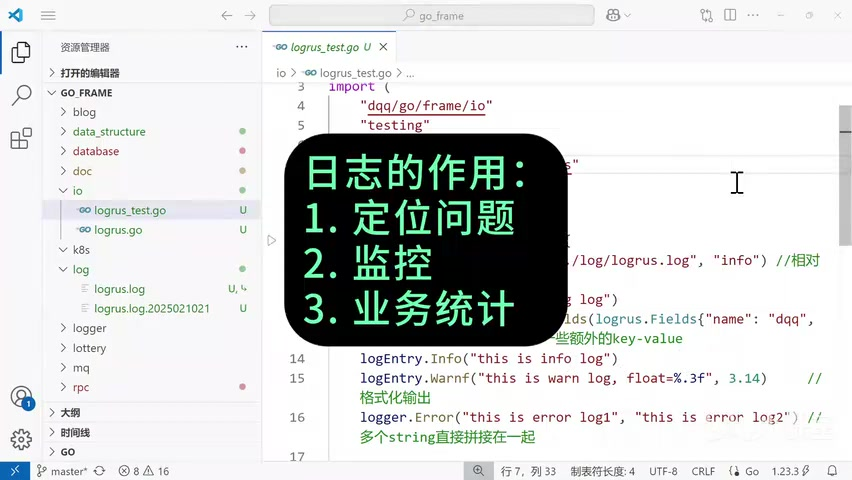

课程使用两个库组合这些能力：

```text
Logrus
  ├─ 级别过滤
  ├─ 文本 / JSON 格式
  ├─ 结构化字段
  ├─ 调用者信息
  └─ Hook 扩展

file-rotatelogs
  ├─ 按时间切分文件
  ├─ 最新文件软链接
  └─ 过期文件清理
```

最终形成的日志管线是：

```text
业务代码创建 Entry
        ↓
按 Logger.Level 过滤
        ↓
执行匹配级别的 Hook
        ↓
Formatter 编码为文本或 JSON
        ↓
写入 rotatelogs.Writer
        ↓
按小时轮转并清理过期文件
```

## 1. 视频路线图

| 时间        | 内容                                     |
| ----------- | ---------------------------------------- |
| 00:00–02:18 | 日志用途、日志文件结构、级别和调用位置   |
| 02:18–03:38 | 级别过滤与 `InitLogrus` 初始化           |
| 03:38–04:39 | `TextFormatter` 与 `JSONFormatter`       |
| 04:39–06:18 | 文件名、软链接、轮转周期和保留时间       |
| 06:18–07:38 | 输出目标、调用者信息和 Hook 的用途       |
| 07:38–09:46 | 实现 `logrus.Hook`：`Levels` 与 `Fire`   |
| 09:46–11:30 | `Debug`、`WithFields`、`Warnf`、可变参数 |
| 11:30–12:04 | `Fatal`、`Panic`、`os.Exit` 与 `recover` |
| 12:04–14:06 | 运行测试并逐项验证 JSON 日志与 Hook      |

## 2. 安装依赖

课程使用 Logrus 和按时间轮转的 writer：

```sh
go get github.com/sirupsen/logrus
go get github.com/lestrrat-go/file-rotatelogs
go mod tidy
```

在代码中分别导入：

```go
import (
    rotatelogs "github.com/lestrrat-go/file-rotatelogs"
    "github.com/sirupsen/logrus"
)
```

`rotatelogs` 使用别名能让调用点更短，也明确它承担的是文件轮转职责。

## 3. 先看一条日志包含什么

课程开头展示的普通文本日志包含：

```text
time="2025-02-10 21:20:36.731"
level=info
msg="this is info log"
func=dqq/go/frame/io_test.TestLogrus
file="D:/go_project/go_frame/io/logrus_test.go:14"
age=18
name=dqq
```

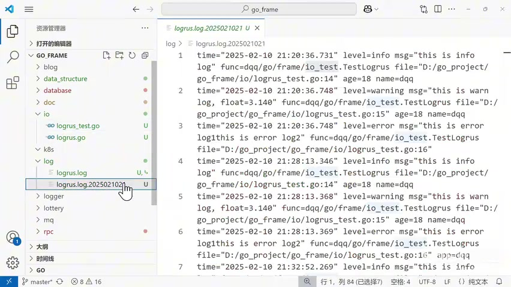

这些字段各自承担不同职责：

| 字段                 | 含义                         |
| -------------------- | ---------------------------- |
| `time`               | 事件发生时间，示例精确到毫秒 |
| `level`              | 严重程度，也是过滤依据       |
| `msg`                | 人类可读的事件说明           |
| `func`               | 产生日志的函数               |
| `file`               | 源文件路径与行号             |
| `name`、`age`、`app` | 可检索、可聚合的业务上下文   |

`func` 中的 `dqq/go/frame` 是 module 路径，`io_test` 是包名，`TestLogrus` 是函数名。`file` 能进一步定位到 `logrus_test.go:14`。

## 4. 创建独立 Logger，而不是依赖包级全局状态

初始化函数的签名是：

```go
func InitLogrus(logFile, level string) *logrus.Logger {
    logger := logrus.New()
    // 配置 logger
    return logger
}
```

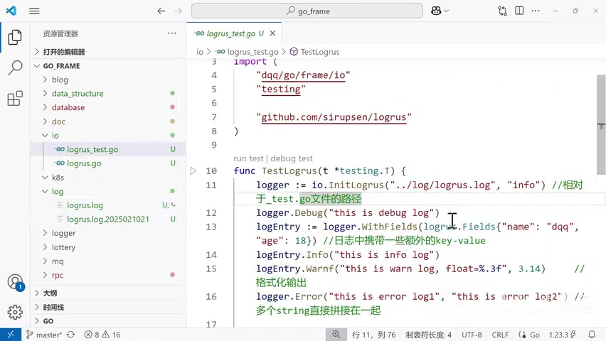

`logrus.New()` 返回一个独立实例。这样做便于：

- 为不同组件设置不同级别和输出文件；
- 在测试中替换输出目标；
- 避免包级全局 logger 被其他代码意外修改；
- 让初始化依赖显式传入业务组件。

更完整的工程代码通常会让初始化函数返回错误：

```go
func NewLogger(logFile, level string) (*logrus.Logger, error)
```

课程为简化演示直接 `panic`；可复用库不应替调用者决定进程是否退出。

## 5. 日志级别与过滤

课程涉及的级别从低严重度到高严重度可理解为：

```text
debug → info → warn → error → fatal → panic
```

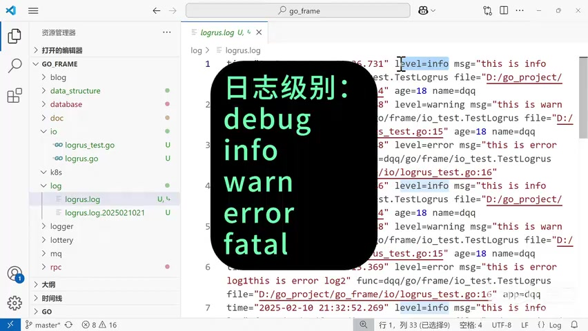

当 logger 设置为 `info` 时，`debug` 会被过滤，而 `info`、`warn`、`error`、`fatal`、`panic` 可以通过。这样，调试代码不必在上线时删除，只需调整阈值。

课程把字符串统一转成小写，再映射到 Logrus 常量：

```go
switch strings.ToLower(level) {
case "debug":
    logger.SetLevel(logrus.DebugLevel)
case "info":
    logger.SetLevel(logrus.InfoLevel)
case "warn":
    logger.SetLevel(logrus.WarnLevel)
case "error":
    logger.SetLevel(logrus.ErrorLevel)
case "fatal":
    logger.SetLevel(logrus.FatalLevel)
case "panic":
    logger.SetLevel(logrus.PanicLevel)
default:
    panic(fmt.Errorf("invalid log level %s", level))
}
```

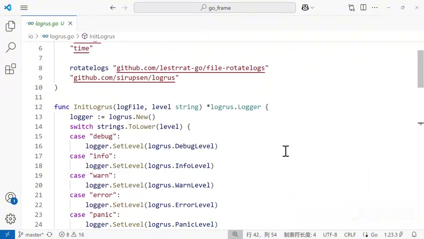

Logrus 本身也提供解析函数，可以减少手写分支：

```go
parsed, err := logrus.ParseLevel(level)
if err != nil {
    return nil, fmt.Errorf("parse log level %q: %w", level, err)
}
logger.SetLevel(parsed)
```

这还会自然支持 Logrus 的 `trace` 级别。

## 6. 文本格式与 JSON 格式

### 6.1 普通文本

课程先展示 `TextFormatter`：

```go
logger.SetFormatter(&logrus.TextFormatter{
    DisableColors:   true,
    TimestampFormat: "2006-01-02 15:04:05.000",
})
```

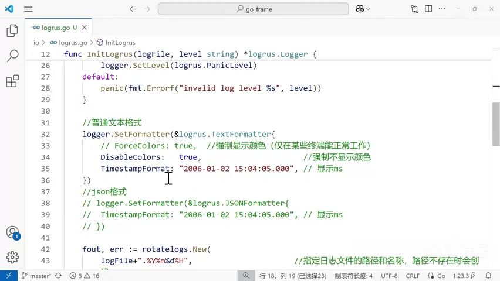

Go 的时间格式不是 `YYYY-MM-DD`，而是用固定参考时间 `2006-01-02 15:04:05` 描述布局；结尾 `.000` 表示毫秒。

写文件时通常关闭 ANSI 颜色，因为颜色控制字符会污染文件，也不利于后续解析。终端是否支持颜色则取决于实际环境。

### 6.2 JSON

资源文件中的最终选择是 JSON：

```go
logger.SetFormatter(&logrus.JSONFormatter{
    TimestampFormat: "2006-01-02 15:04:05.000",
})
```

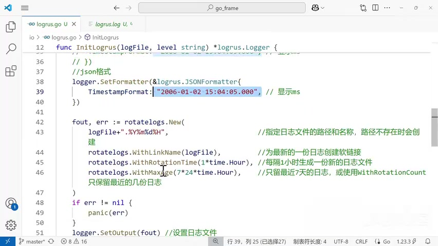

JSON 更适合交给日志平台处理：字段类型和边界明确，能够按 `level`、`app`、`name` 等字段过滤与聚合。文本格式更适合直接阅读；二者没有绝对优劣，取决于消费端。

## 7. 按小时轮转日志文件

资源代码创建了一个实现 `io.Writer` 的轮转输出：

```go
fout, err := rotatelogs.New(
    logFile+".%Y%m%d%H",
    rotatelogs.WithLinkName(logFile),
    rotatelogs.WithRotationTime(1*time.Hour),
    rotatelogs.WithMaxAge(7*24*time.Hour),
)
if err != nil {
    panic(err)
}
logger.SetOutput(fout)
```

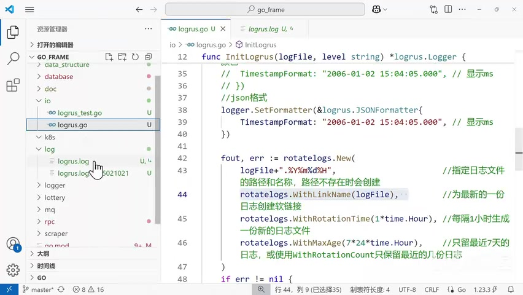

四个参数应分别理解：

| 配置               | 示例                  | 作用                       |
| ------------------ | --------------------- | -------------------------- |
| 文件模式           | `logrus.log.%Y%m%d%H` | 文件名包含年月日小时       |
| `WithLinkName`     | `logrus.log`          | 用稳定路径指向当前最新文件 |
| `WithRotationTime` | `1*time.Hour`         | 每小时创建一个轮转文件     |
| `WithMaxAge`       | `7*24*time.Hour`      | 清理超过七天的旧日志       |

这里的 `%Y%m%d%H` 是轮转库的时间模板，不是 Go 的 `2006-01-02` 时间布局。两种语法相邻出现，最容易混淆。

轮转周期应由日志量决定：高流量服务可能按小时甚至更短周期切分，低流量服务可以按天。仅设置轮转、不设置保留上限，会让日志长期占用磁盘；仅设置保留时间，也不能替代磁盘容量监控。

## 8. 输出位置与调用者信息

```go
logger.SetOutput(fout)
// logger.SetOutput(os.Stdout)
logger.SetReportCaller(true)
```

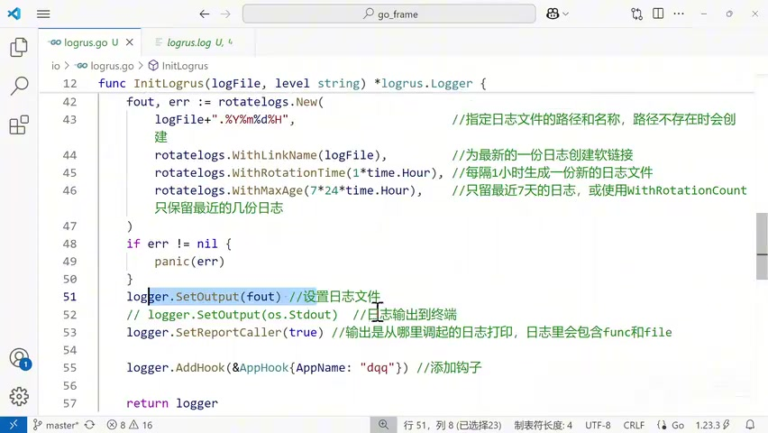

- `SetOutput(fout)`：写入轮转文件；
- `SetOutput(os.Stdout)`：写到标准输出，适合由容器运行时统一采集；
- `SetReportCaller(true)`：增加 `func` 和 `file` 字段。

调用者信息让定位更快，但解析调用栈有额外成本。是否开启应结合性能测量决定，而不是机械地在所有高频日志上启用。

## 9. Hook：在输出日志前扩展行为

Hook 适合在满足特定级别时执行附加动作，例如：

- 给严重错误增加统一的 `app`、`service` 或 `environment` 字段；
- 发送告警事件；
- 投递到 Kafka、日志管道或审计存储；
- 统计特定错误的出现次数。

注册方式：

```go
logger.AddHook(&AppHook{AppName: "dqq"})
```

要成为 Logrus Hook，一个类型必须实现 `Levels` 和 `Fire`。

### 9.1 定义 Hook 状态

```go
type AppHook struct {
    AppName string
}
```

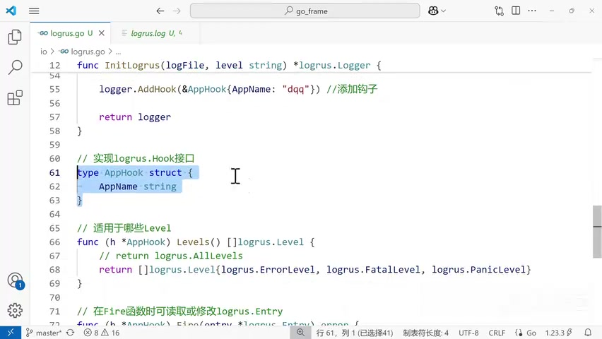

### 9.2 用 `Levels` 选择触发范围

```go
func (h *AppHook) Levels() []logrus.Level {
    return []logrus.Level{
        logrus.ErrorLevel,
        logrus.FatalLevel,
        logrus.PanicLevel,
    }
}
```

返回 `logrus.AllLevels` 会让 Hook 对所有级别执行。课程只选择 `error`、`fatal`、`panic`，避免普通日志触发严重错误处理流程。

### 9.3 用 `Fire` 读取或修改 Entry

```go
func (h *AppHook) Fire(entry *logrus.Entry) error {
    entry.Data["app"] = h.AppName
    fmt.Println(entry.Message)
    return nil
}
```

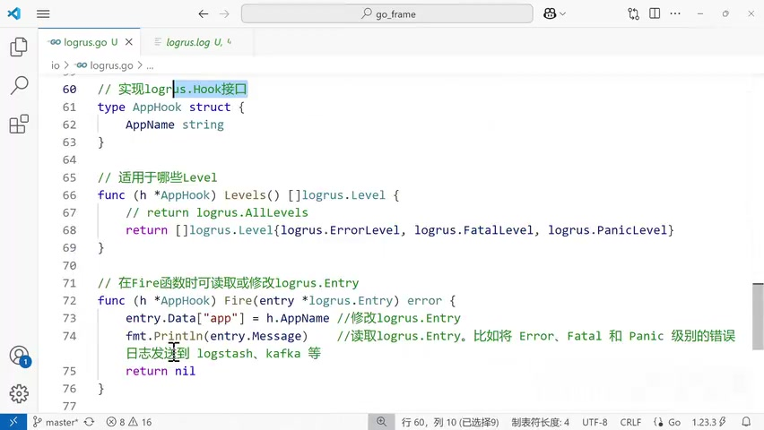

`entry.Data` 是结构化字段集合。写入 `app` 后，最终日志会多出：

```json
{ "app": "dqq", "level": "error", "msg": "..." }
```

`entry.Message` 是本次日志的消息。课程为了演示把它打印到终端，所以测试终端会出现 error 和 panic 消息。

生产 Hook 不宜直接执行缓慢、容易阻塞的网络请求，否则写日志会拖慢业务请求。常见做法是把轻量事件投入有界队列，由独立 worker 发送；队列满、发送失败和应用退出时的行为都要明确。

## 10. 记录普通消息与结构化字段

测试代码先创建 logger：

```go
logger := io.InitLogrus("../log/logrus.log", "info")
logger.Debug("this is debug log")
```

由于阈值是 `info`，这条 `debug` 不会出现在文件中。

### 10.1 `WithFields` 创建带上下文的 Entry

```go
logEntry := logger.WithFields(logrus.Fields{
    "name": "dqq",
    "age":  18,
})
logEntry.Info("this is info log")
```

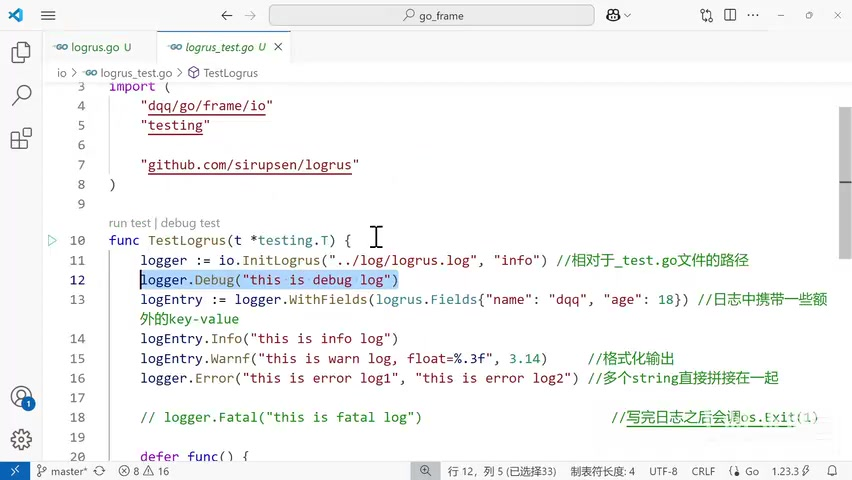

`WithFields` 不会立即输出，它返回一个携带字段的 `*logrus.Entry`。之后从该 Entry 写出的日志都会带上 `name` 和 `age`。

工程中可在请求入口先创建上下文 Entry：

```go
requestLog := logger.WithFields(logrus.Fields{
    "request_id": requestID,
    "user_id":    userID,
})

requestLog.Info("request started")
requestLog.WithField("duration_ms", elapsed.Milliseconds()).Info("request completed")
```

稳定的字段名比把所有信息拼进 `msg` 更利于检索。

### 10.2 格式化输出

```go
logEntry.Warnf("this is warn log, float=%.3f", 3.14)
```

`Warnf` 使用 `fmt.Printf` 风格；`%.3f` 把浮点数格式化为三位小数，结果为 `3.140`。

### 10.3 可变参数会直接拼接

```go
logger.Error("this is error log1", "this is error log2")
```

画面中的最终消息是：

```text
this is error log1this is error log2
```

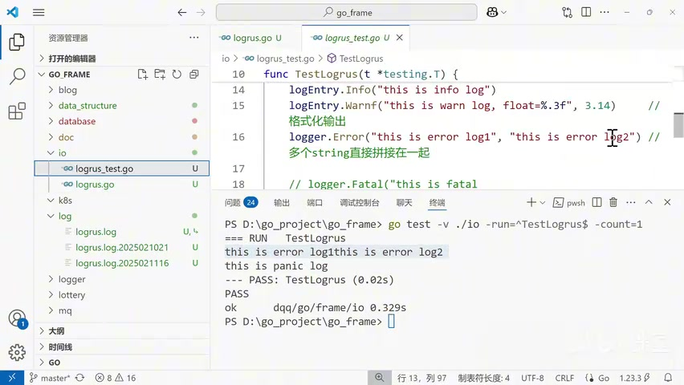

多个字符串不会自动补空格。可改为：

```go
logger.Error("this is error log1: this is error log2")
// 或显式格式化
logger.Errorf("%s: %s", first, second)
```

## 11. `Fatal` 与 `Panic` 不是普通级别

```go
logger.Fatal("this is fatal log")
logger.Panic("this is panic log")
```

二者除了写日志，还会改变控制流：

- `Fatal`：写日志后调用 `os.Exit(1)`，当前进程的 `defer` 不会运行；
- `Panic`：写日志后触发 `panic`，可以在合适的边界用 `recover` 捕获，正常的栈展开会执行 `defer`。

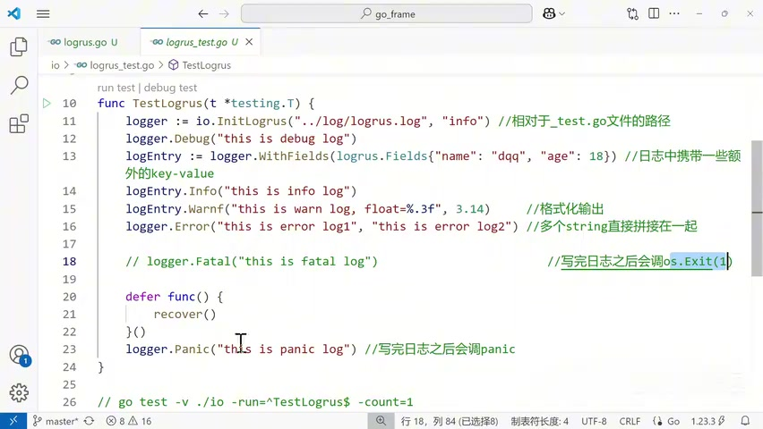

因此，深层业务函数通常应返回错误，让 `main` 或请求边界统一决定是否退出。到处调用 `Fatal` 会让测试、资源清理和错误恢复变得困难。

课程测试把 Fatal 注释掉，并捕获 Panic：

```go
defer func() {
    recover()
}()
logger.Panic("this is panic log")
```

更可靠的测试应断言确实发生了 panic：

```go
defer func() {
    if recovered := recover(); recovered == nil {
        t.Fatal("expected logger.Panic to panic")
    }
}()
logger.Panic("this is panic log")
```

## 12. 运行测试并核对结果

课程运行：

```sh
go test -v ./io -run=^TestLogrus$ -count=1
```

参数含义：

- `-v`：显示详细测试输出；
- `./io`：测试 `io` 包；
- `-run=^TestLogrus$`：只运行名称完全匹配的测试；
- `-count=1`：禁用本次测试缓存。

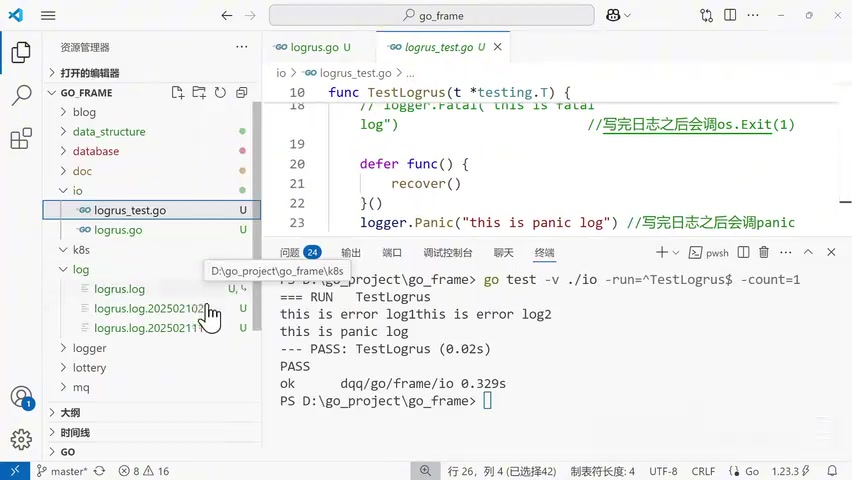

终端输出：

```text
=== RUN   TestLogrus
this is error log1this is error log2
this is panic log
--- PASS: TestLogrus
PASS
```

同时，新轮转文件被创建，稳定文件名软链接到最新文件。JSON 中可以逐项核对：

- 没有 debug：因为 logger 的阈值是 info；
- info 和 warn 带 `name`、`age`：因为它们由 `logEntry` 输出；
- error 不带 `name`、`age`：因为它由 `logger` 直接输出；
- error 和 panic 带 `app=dqq`：因为 Hook 只匹配这类高严重度级别；
- 所有输出带 `func`、`file`：因为开启了 `SetReportCaller(true)`。

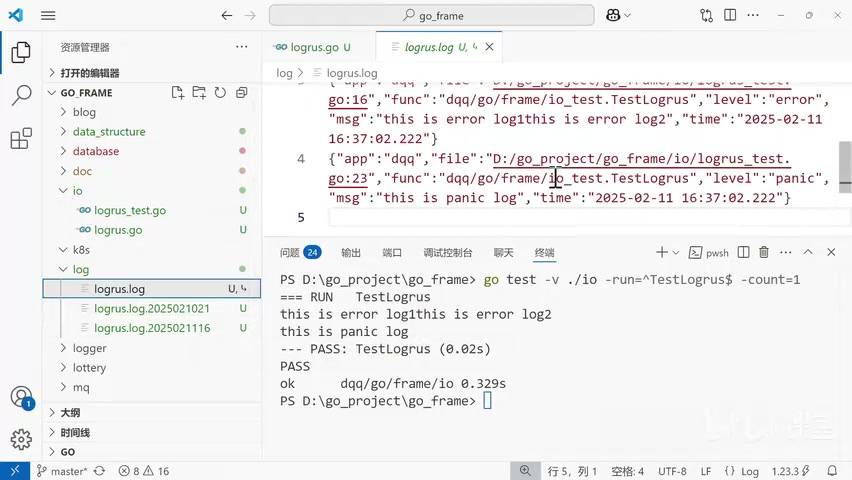

## 13. 完整初始化代码拆解

把课程实现压缩成步骤，顺序如下：

```go
func InitLogrus(logFile, level string) *logrus.Logger {
    // 1. 独立实例
    logger := logrus.New()

    // 2. 解析并设置级别
    switch strings.ToLower(level) {
    case "debug":
        logger.SetLevel(logrus.DebugLevel)
    case "info":
        logger.SetLevel(logrus.InfoLevel)
    case "warn":
        logger.SetLevel(logrus.WarnLevel)
    case "error":
        logger.SetLevel(logrus.ErrorLevel)
    case "fatal":
        logger.SetLevel(logrus.FatalLevel)
    case "panic":
        logger.SetLevel(logrus.PanicLevel)
    default:
        panic(fmt.Errorf("invalid log level %s", level))
    }

    // 3. JSON 格式
    logger.SetFormatter(&logrus.JSONFormatter{
        TimestampFormat: "2006-01-02 15:04:05.000",
    })

    // 4. 文件轮转
    fout, err := rotatelogs.New(
        logFile+".%Y%m%d%H",
        rotatelogs.WithLinkName(logFile),
        rotatelogs.WithRotationTime(time.Hour),
        rotatelogs.WithMaxAge(7*24*time.Hour),
    )
    if err != nil {
        panic(err)
    }

    // 5. 输出、调用者和 Hook
    logger.SetOutput(fout)
    logger.SetReportCaller(true)
    logger.AddHook(&AppHook{AppName: "dqq"})

    return logger
}
```

## 14. 一页 API 总结

| API                            | 作用                       |
| ------------------------------ | -------------------------- |
| `logrus.New()`                 | 创建独立 Logger            |
| `logrus.ParseLevel`            | 把字符串解析为级别         |
| `logger.SetLevel`              | 设置最低输出阈值           |
| `logger.SetFormatter`          | 选择文本或 JSON 编码       |
| `logger.SetOutput`             | 设置 `io.Writer` 输出目标  |
| `logger.SetReportCaller`       | 加入函数、文件和行号       |
| `logger.WithField(s)`          | 创建带结构化上下文的 Entry |
| `logger.Debug/Info/Warn/Error` | 按级别输出普通消息         |
| `logger.Warnf` 等              | 使用格式字符串输出         |
| `logger.Fatal`                 | 写日志后 `os.Exit(1)`      |
| `logger.Panic`                 | 写日志后触发 panic         |
| `logger.AddHook`               | 注册扩展行为               |
| `Hook.Levels`                  | 声明 Hook 适用级别         |
| `Hook.Fire`                    | 读取或修改本次 Entry       |
| `rotatelogs.New`               | 创建按时间轮转的 writer    |

## 15. 最终心智模型

```text
初始化阶段
  New Logger
    → Parse/Set Level
    → Set Formatter
    → Set rotating Output
    → SetReportCaller
    → AddHook

运行阶段
  logger / entry 接收事件与字段
    → 级别过滤
    → 匹配 Hook 读取或补充 Entry
    → Formatter 编码
    → writer 写出并按策略轮转
```

Logrus 负责“事件如何被筛选、组织和扩展”，`file-rotatelogs` 负责“文件如何切分和保留”。真正可维护的日志系统还需要应用自己定义稳定字段、敏感信息策略、Hook 的失败边界，以及可自动验证的测试。

## Appendix：课程完整资源代码

`logrus.go`

```go
package io

import (
    "fmt"
    "strings"
    "time"

    rotatelogs "github.com/lestrrat-go/file-rotatelogs"
    "github.com/sirupsen/logrus"
)

func InitLogrus(logFile, level string) *logrus.Logger {
    logger := logrus.New()
    switch strings.ToLower(level) {
    case "debug":
        logger.SetLevel(logrus.DebugLevel)
    case "info":
        logger.SetLevel(logrus.InfoLevel)
    case "warn":
        logger.SetLevel(logrus.WarnLevel)
    case "error":
        logger.SetLevel(logrus.ErrorLevel)
    case "fatal":
        logger.SetLevel(logrus.FatalLevel)
    case "panic":
        logger.SetLevel(logrus.PanicLevel)
    default:
        panic(fmt.Errorf("invalid log level %s", level))
    }

    // 普通文本格式（课程演示；资源最终选择 JSON）
    // logger.SetFormatter(&logrus.TextFormatter{
    //     DisableColors:   true,
    //     TimestampFormat: "2006-01-02 15:04:05.000",
    // })
    logger.SetFormatter(&logrus.JSONFormatter{
        TimestampFormat: "2006-01-02 15:04:05.000",
    })

    fout, err := rotatelogs.New(
        logFile+".%Y%m%d%H",
        rotatelogs.WithLinkName(logFile),
        rotatelogs.WithRotationTime(1*time.Hour),
        rotatelogs.WithMaxAge(7*24*time.Hour),
    )
    if err != nil {
        panic(err)
    }
    logger.SetOutput(fout)
    logger.SetReportCaller(true)
    logger.AddHook(&AppHook{AppName: "dqq"})

    return logger
}

type AppHook struct {
    AppName string
}

func (h *AppHook) Levels() []logrus.Level {
    return []logrus.Level{
        logrus.ErrorLevel,
        logrus.FatalLevel,
        logrus.PanicLevel,
    }
}

func (h *AppHook) Fire(entry *logrus.Entry) error {
    entry.Data["app"] = h.AppName
    fmt.Println(entry.Message)
    return nil
}
```

`logrus_test.go`

```go
package io_test

import (
    "dqq/go/frame/io"
    "testing"

    "github.com/sirupsen/logrus"
)

func TestLogrus(t *testing.T) {
    logger := io.InitLogrus("../log/logrus.log", "info")
    logger.Debug("this is debug log")
    logEntry := logger.WithFields(logrus.Fields{
        "name": "dqq",
        "age":  18,
    })
    logEntry.Info("this is info log")
    logEntry.Warnf("this is warn log, float=%.3f", 3.14)
    logger.Error("this is error log1", "this is error log2")

    // logger.Fatal("this is fatal log")

    defer func() {
        recover()
    }()
    logger.Panic("this is panic log")
}

// go test -v ./io -run=^TestLogrus$ -count=1
```
