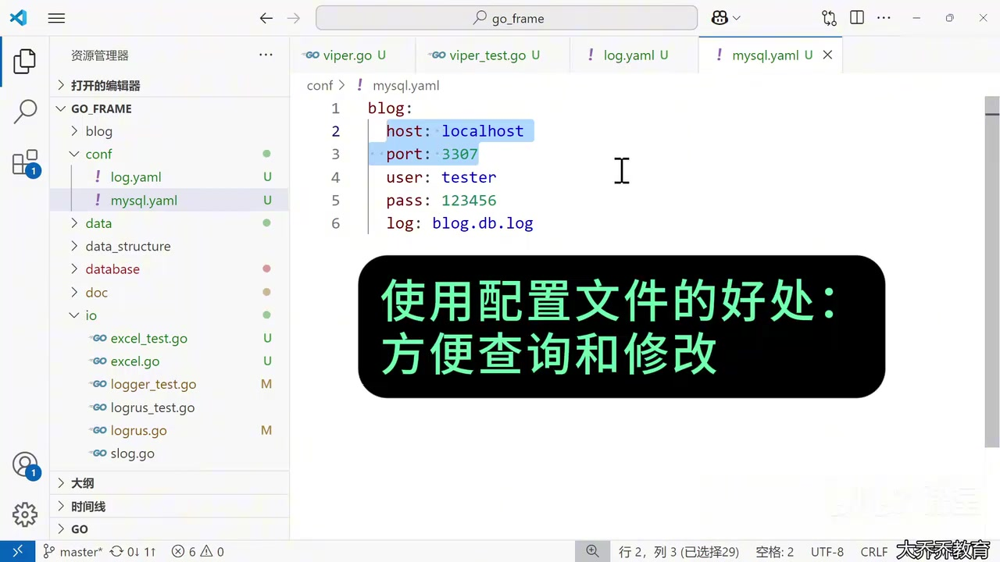
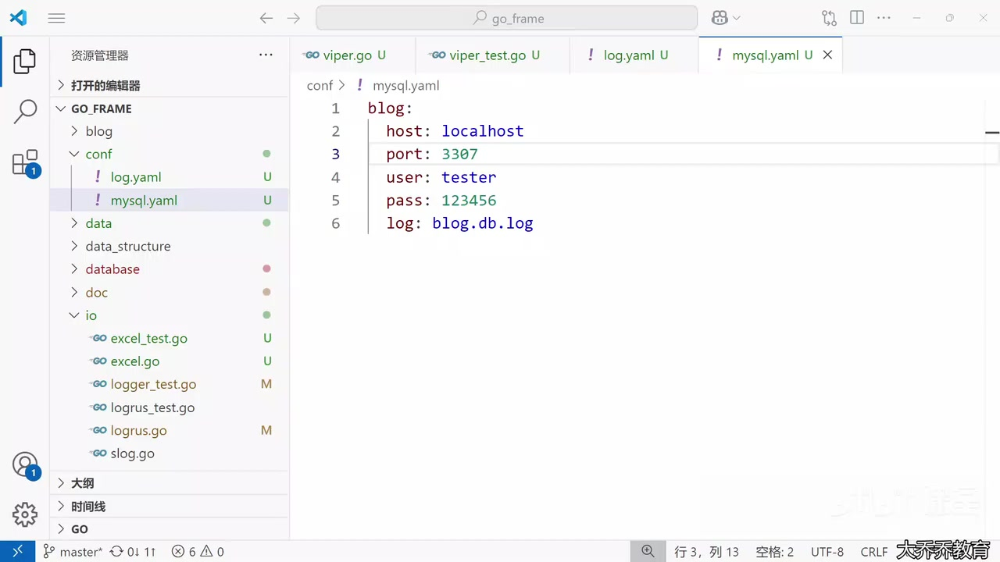
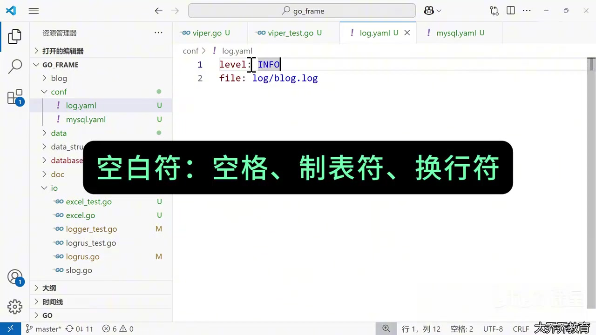
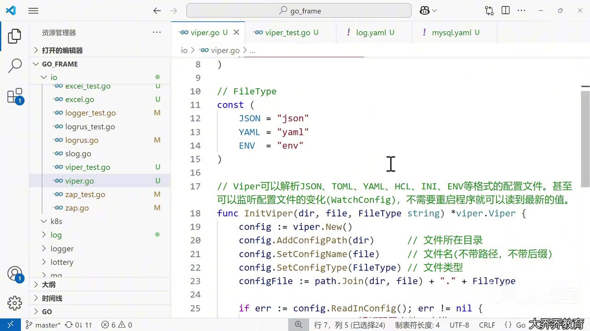
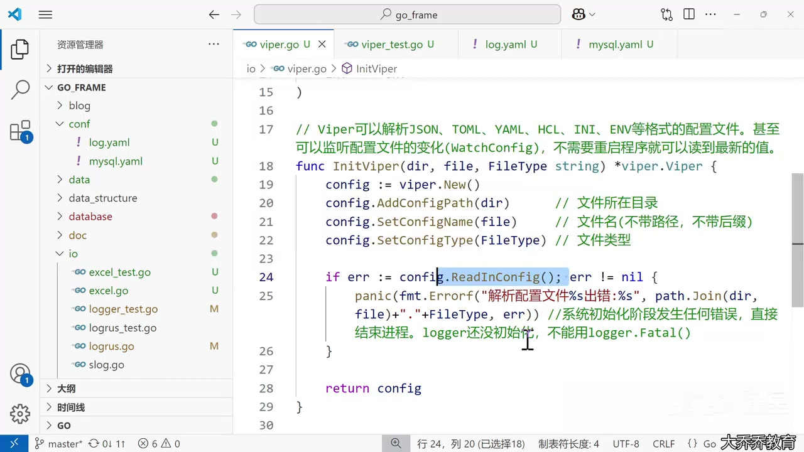
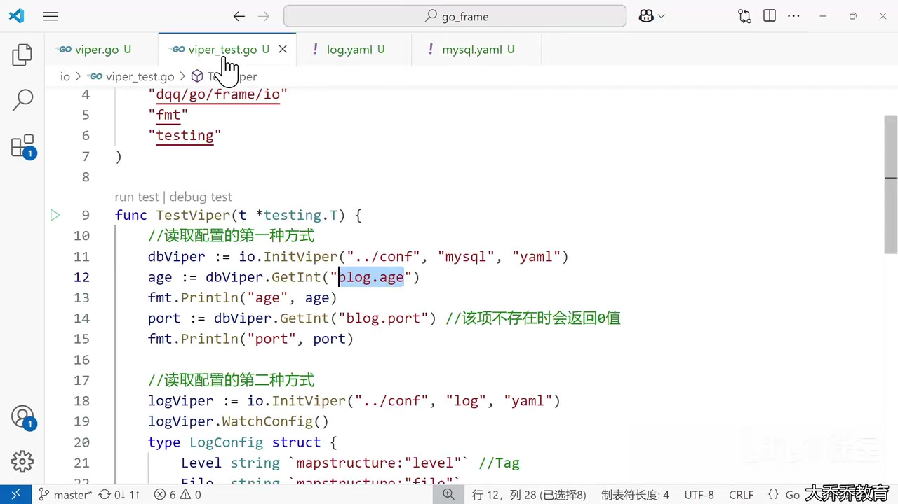
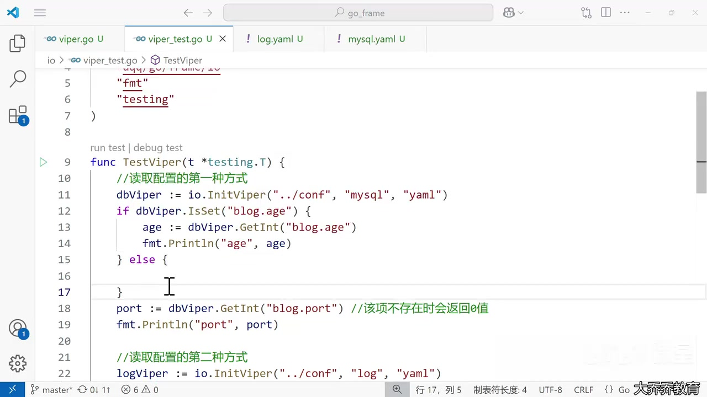
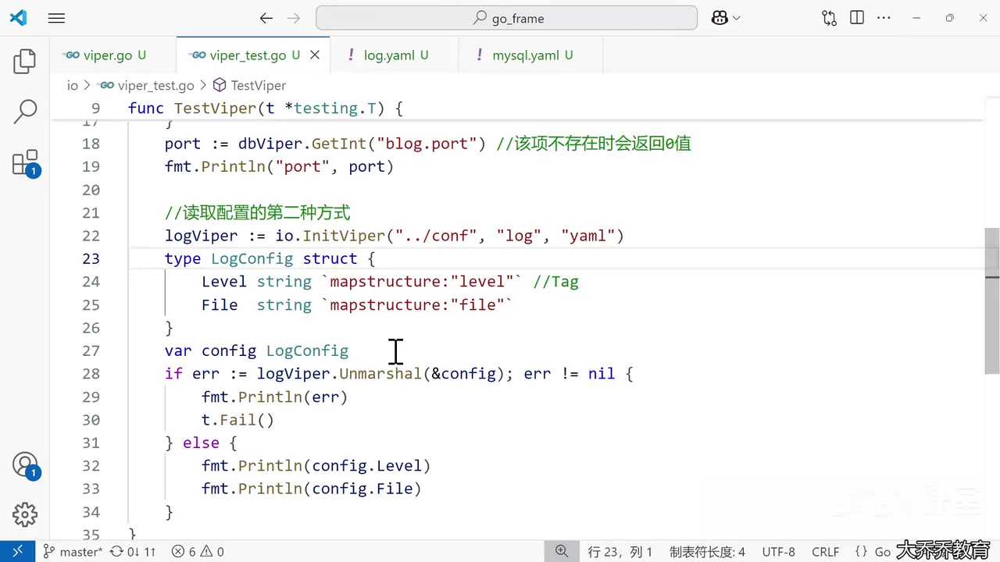
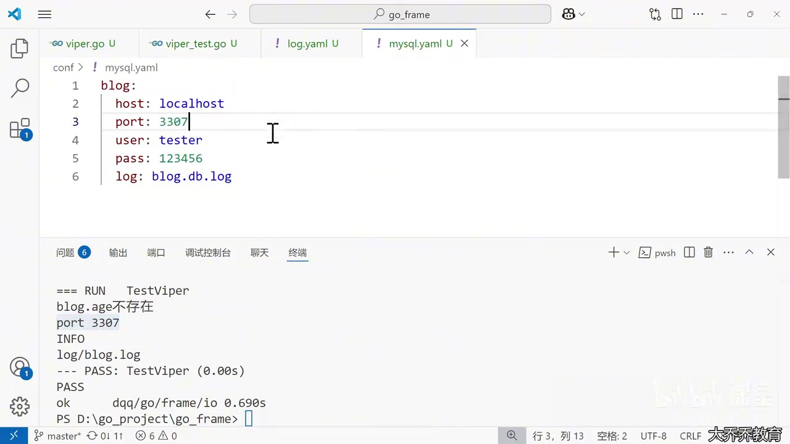
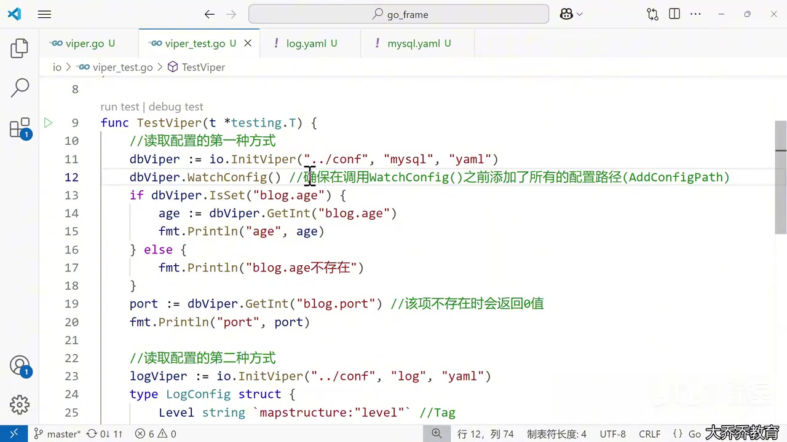

# 第 171 课：使用 Viper 解析配置文件

> 中文课堂式完整笔记
> 视频时长：10:03
> 资料来源：完整 AI 字幕、43 张去重画面、`resources/viper.go` 与 `resources/viper_test.go`
> 校对原则：API、标识符和代码以画面及资源文件为准；字幕中的“YAO”“WIFI”“is site”等均校正为 YAML、Viper、`IsSet`。
> Reference: https://www.bilibili.com/cheese/play/ep1597970

## 0. 这节课解决什么问题

实际项目几乎离不开配置：数据库地址、端口、日志级别、输出文件等都不适合散落在 Go 源码中。把这些值放进配置文件，主要有三个好处：

- 集中管理，查找和修改更方便；
- 修改配置不等于修改程序逻辑，降低误改代码的风险；
- 配置和代码可以分开交付，避免把环境差异硬编码进程序。



但“配置与代码分离”并不自动等于安全。密码、令牌等敏感值仍不能提交到 Git；生产环境应使用环境变量、密钥管理系统或受控配置中心，并限制配置文件权限。

本课使用 [Viper](https://github.com/spf13/viper) 完成四件事：

```text
定位配置文件 → 读取并解析 → 按键或结构体取值 → 监听文件变化
```

## 1. 视频路线图

| 时间        | 内容                                                  |
| ----------- | ----------------------------------------------------- |
| 00:00–01:38 | 为什么使用配置文件；常见配置格式与 Viper              |
| 01:38–02:39 | YAML 的键值、空白和缩进规则                           |
| 02:39–04:21 | `InitViper`：路径、文件名、类型和解析错误             |
| 04:21–06:29 | 第一种读取方式：`GetInt` 与 `IsSet`                   |
| 06:29–07:51 | 第二种读取方式：结构体、`mapstructure` 与 `Unmarshal` |
| 07:51–08:40 | 运行单元测试并检查输出                                |
| 08:40–10:03 | `WatchConfig`：无需重启读取修改后的配置               |

## 2. 为什么不用全局变量代替配置

下面这些值当然可以写成全局变量：

```go
var host = "localhost"
var port = 3307
```

但每次调整都要修改源码、重新构建和部署，而且环境差异会逐渐侵入业务代码。配置文件让“程序行为参数”成为独立输入：同一份二进制可以搭配开发、测试和生产配置运行。

画面中的 `mysql.yaml` 展示了嵌套配置：

```yaml
blog:
  host: localhost
  port: 3307
  user: tester
  pass: 123456
  log: blog.db.log
```



这里的密码只是课堂示例。实际仓库应使用占位符，例如 `${MYSQL_PASSWORD}`，真实值由部署环境注入。

## 3. YAML 基础：键值、空白与缩进

简单配置可以写成：

```yaml
level: INFO
file: log/blog.log
```

冒号后必须有空白，通常写一个空格。YAML 通过缩进表达层级，而且缩进只能使用一致的空格；实际项目不要用 Tab，以免不同解析器或编辑器产生歧义。



嵌套键 `blog.port` 的含义是：先进入 `blog` 对象，再读取它的 `port` 字段。Viper 默认使用点号访问这种层级。

## 4. 安装与支持的格式

安装 Viper：

```sh
go get github.com/spf13/viper
go mod tidy
```

课程代码为常用类型定义了常量：

```go
const (
    JSON = "json"
    YAML = "yaml"
    ENV  = "env"
)
```

Viper 还支持 TOML、HCL、INI 等格式。使用常量比在调用处散写字符串更容易统一，也能减少拼写错误。

## 5. `InitViper`：创建并读取独立配置实例

资源文件中的完整初始化函数：

```go
package io

import (
    "fmt"
    "path"

    "github.com/spf13/viper"
)

func InitViper(dir, file, FileType string) *viper.Viper {
    config := viper.New()
    config.AddConfigPath(dir)      // 文件所在目录
    config.SetConfigName(file)     // 文件名：不带路径和后缀
    config.SetConfigType(FileType) // 文件类型

    if err := config.ReadInConfig(); err != nil {
        panic(fmt.Errorf(
            "解析配置文件%s出错:%s",
            path.Join(dir, file)+"."+FileType,
            err,
        ))
    }

    return config
}
```



### 三个定位步骤

```go
config.AddConfigPath(dir)
config.SetConfigName(file)
config.SetConfigType(FileType)
```

- `AddConfigPath("../conf")`：增加搜索目录；
- `SetConfigName("mysql")`：只写基本文件名，不能带目录或 `.yaml`；
- `SetConfigType("yaml")`：声明解析格式。

于是：

```go
io.InitViper("../conf", "mysql", io.YAML)
```

会读取 `../conf/mysql.yaml`。

### 为什么使用 `viper.New()`

Viper 也提供包级全局函数，但 `viper.New()` 会返回独立实例。数据库配置和日志配置互不覆盖，测试也更容易隔离：

```go
dbViper  := io.InitViper("../conf", "mysql", io.YAML)
logViper := io.InitViper("../conf", "log", io.YAML)
```

## 6. `ReadInConfig` 与启动失败策略

`ReadInConfig()` 真正查找、读取并解析文件：

```go
if err := config.ReadInConfig(); err != nil {
    panic(fmt.Errorf("解析配置文件失败: %w", err))
}
```



常见失败原因包括：

- 文件路径、名称或后缀写错；
- 文件不存在或没有读取权限；
- YAML 缩进或语法错误；
- 配置内容与预期类型不匹配。

课程在系统初始化阶段直接 `panic`，理由是关键配置不可用时，程序继续启动通常没有意义，而且 logger 可能尚未初始化。工程中可以让底层函数返回错误，由 `main` 决定退出：

```go
func LoadConfig(dir, name, kind string) (*viper.Viper, error) {
    cfg := viper.New()
    cfg.AddConfigPath(dir)
    cfg.SetConfigName(name)
    cfg.SetConfigType(kind)

    if err := cfg.ReadInConfig(); err != nil {
        return nil, fmt.Errorf("read %s: %w", name, err)
    }
    return cfg, nil
}
```

库代码返回错误、程序入口决定是否终止，通常更容易复用和测试。

## 7. 第一种读取方式：按键取值

Viper 提供类型化 getter：

```go
port := dbViper.GetInt("blog.port")
host := dbViper.GetString("blog.host")
enabled := dbViper.GetBool("feature.enabled")
timeout := dbViper.GetDuration("server.timeout")
```



这种方式适合：

- 只需要少量配置项；
- 键由运行时决定；
- 临时工具或简单脚本。

问题是 getter 在键不存在时通常返回该类型的零值。例如：

```go
age := dbViper.GetInt("blog.age") // 不存在时得到 0
```

仅看到 `0`，无法区分“配置确实是 0”和“根本没配置”。

## 8. 用 `IsSet` 区分缺失值与零值

先检查键是否存在，再读取：

```go
if dbViper.IsSet("blog.age") {
    age := dbViper.GetInt("blog.age")
    fmt.Println("age", age)
} else {
    fmt.Println("blog.age不存在")
}
```



配置项可以分为两类：

- 必填项：缺失时返回错误，阻止启动；
- 可选项：通过默认值或明确分支处理。

可选项也可以预设默认值：

```go
cfg.SetDefault("server.port", 8080)
port := cfg.GetInt("server.port")
```

默认值应写入文档，避免使用者不知道程序最终采用了什么。

## 9. 第二种读取方式：反序列化到结构体

配置项较多时，逐个调用 getter 会让代码分散。课程把 `log.yaml` 映射到结构体：

```go
type LogConfig struct {
    Level string `mapstructure:"level"`
    File  string `mapstructure:"file"`
}

var config LogConfig
if err := logViper.Unmarshal(&config); err != nil {
    fmt.Println(err)
    t.Fail()
} else {
    fmt.Println(config.Level)
    fmt.Println(config.File)
}
```



`mapstructure` 标签声明“配置键 → Go 字段”的映射：

```text
level → LogConfig.Level
file  → LogConfig.File
```

这种方式的优点：

- 配置结构集中且类型明确；
- IDE 能补全字段名；
- 业务代码不再散布字符串键；
- 更适合进一步做必填、范围和组合规则校验。

反序列化成功只说明“能够映射”，不保证业务语义正确。还应检查日志级别是否合法、路径是否为空、端口是否在有效范围内等。

## 10. 完整测试代码

资源中的测试展示了两种读取方式和热更新：

```go
func TestViper(t *testing.T) {
    // 第一种：按键读取
    dbViper := io.InitViper("../conf", "mysql", io.YAML)
    dbViper.WatchConfig()
    if dbViper.IsSet("blog.age") {
        age := dbViper.GetInt("blog.age")
        fmt.Println("age", age)
    } else {
        fmt.Println("blog.age不存在")
    }

    port := dbViper.GetInt("blog.port")
    fmt.Println("port", port)
    time.Sleep(10 * time.Second)
    port = dbViper.GetInt("blog.port")
    fmt.Println("port", port)

    // 第二种：映射到结构体
    logViper := io.InitViper("../conf", "log", io.YAML)
    type LogConfig struct {
        Level string `mapstructure:"level"`
        File  string `mapstructure:"file"`
    }

    var config LogConfig
    if err := logViper.Unmarshal(&config); err != nil {
        fmt.Println(err)
        t.Fail()
    } else {
        fmt.Println(config.Level)
        fmt.Println(config.File)
    }
}
```

运行命令：

```sh
go test -v ./io -run=^TestViper$ -count=1
```

- `-v`：显示详细测试输出；
- `./io`：测试 `io` 包；
- `-run=^TestViper$`：只运行名称完全匹配的测试；
- `-count=1`：禁用本次测试缓存。

第一次运行的画面输出：

```text
blog.age不存在
port 3307
INFO
log/blog.log
--- PASS: TestViper (0.00s)
```



## 11. `WatchConfig`：配置热更新

默认情况下，`ReadInConfig()` 只在调用时读取一次。要让 Viper 监听已加载配置文件的变化，需要显式调用：

```go
dbViper := io.InitViper("../conf", "mysql", io.YAML)
dbViper.WatchConfig()
```

调用顺序很重要：先用 `AddConfigPath`、`SetConfigName`、`SetConfigType` 完成定位并读取，再启动监听。



课程用 `Sleep` 留出人工修改时间：

```go
port := dbViper.GetInt("blog.port")
fmt.Println("port", port)

time.Sleep(10 * time.Second)

port = dbViper.GetInt("blog.port")
fmt.Println("port", port)
```

10 秒内把 YAML 的端口从 `3307` 改为 `3306`，第二次读取无需重启程序：

```text
port 3307
port 3306
```


## 12. 热更新的工程边界

“文件变化能被读到”不等于“所有组件都会自动重配”。如果数据库连接池在启动时用旧配置创建，仅仅让 Viper 读到新端口不会自动重建连接池。

需要热更新时，通常还要注册变化回调并定义哪些字段允许动态修改：

```go
cfg.OnConfigChange(func(event fsnotify.Event) {
    fmt.Println("config changed:", event.Name)
    // 重新解析、校验，并以线程安全方式更新可热变更组件
})
cfg.WatchConfig()
```

实践原则：

- 日志级别、开关、限流参数通常适合热更新；
- 数据库地址、监听端口等可能要求重建资源或重启；
- 回调内先解析和校验，失败时保留最后一份有效配置；
- 并发读取的配置应使用不可变快照、锁或 `atomic.Value`；
- 编辑器保存文件可能触发多次事件，复杂逻辑需要防抖或幂等处理。

## 13. 课程代码值得注意的细节

### 参数名应使用小写开头

资源代码使用 `FileType string`。Go 中局部参数通常写成：

```go
func InitViper(dir, file, fileType string) *viper.Viper
```

这是命名风格改进，不影响功能。

### 构造路径宜用 `filepath.Join`

课程只把 `path.Join` 用于错误信息。对于本地文件系统路径，更惯用：

```go
filepath.Join(dir, file+"."+fileType)
```

### 测试不要只打印结果

自动测试应断言值：

```go
if got := dbViper.GetInt("blog.port"); got != 3307 {
    t.Fatalf("port = %d, want 3307", got)
}
```

测试热更新时也不应依赖人工编辑和固定睡眠。更可靠的做法是在临时目录创建配置文件、程序化修改，并在带超时的轮询或事件通道中等待结果。

## 14. 一个更适合项目的配置模型

把所有配置集中成一个根结构体：

```go
type Config struct {
    Blog BlogConfig `mapstructure:"blog"`
    Log  LogConfig  `mapstructure:"log"`
}

type BlogConfig struct {
    Host string `mapstructure:"host"`
    Port int    `mapstructure:"port"`
    User string `mapstructure:"user"`
    Pass string `mapstructure:"pass"`
}

type LogConfig struct {
    Level string `mapstructure:"level"`
    File  string `mapstructure:"file"`
}
```

读取后统一校验：

```go
func (c Config) Validate() error {
    if c.Blog.Host == "" {
        return errors.New("blog.host is required")
    }
    if c.Blog.Port < 1 || c.Blog.Port > 65535 {
        return fmt.Errorf("blog.port out of range: %d", c.Blog.Port)
    }
    return nil
}
```

这让“读取”“类型转换”“业务校验”成为清晰的三个步骤。

## 15. 一页 API 总结

| API                      | 作用                                 |
| ------------------------ | ------------------------------------ |
| `viper.New()`            | 创建独立 Viper 实例                  |
| `AddConfigPath(dir)`     | 增加配置搜索目录                     |
| `SetConfigName(name)`    | 设置不带路径和后缀的文件名           |
| `SetConfigType(kind)`    | 指定 YAML、JSON 等类型               |
| `ReadInConfig()`         | 查找、读取并解析配置文件             |
| `GetInt / GetString`     | 按键读取并转换为目标类型             |
| `IsSet(key)`             | 判断配置键是否存在                   |
| `SetDefault(key, value)` | 设置可选项默认值                     |
| `Unmarshal(&dst)`        | 映射到带 `mapstructure` 标签的结构体 |
| `WatchConfig()`          | 监听已加载配置文件的变化             |
| `OnConfigChange(fn)`     | 在配置变化时执行回调                 |

## 16. 常见错误清单

- 把 `SetConfigName` 写成 `../conf/mysql.yaml`；它只应接收 `mysql`。
- YAML 冒号后没有空格，或缩进层级不一致。
- 直接使用 getter 的零值，却没有判断键是否缺失。
- `mapstructure` 标签拼错，导致字段没有被填充。
- 只调用 `WatchConfig`，却以为业务组件会自动应用新配置。
- 把真实密码提交到仓库，误以为“放在 YAML 就安全”。
- 在测试中依赖人工改文件和长时间 `Sleep`。
- 使用包级全局 Viper 读取多份配置，造成状态相互污染。

## 17. 实践任务

1. 创建 `mysql.yaml` 和 `log.yaml`，运行课程测试。
2. 删除 `blog.age`，用 `IsSet` 验证缺失分支。
3. 给可选端口设置默认值，并打印最终生效值。
4. 把数据库配置完整映射为嵌套结构体。
5. 为端口范围和日志级别编写 `Validate`。
6. 把 `InitViper` 改成返回 `(*viper.Viper, error)`。
7. 用 `t.TempDir()` 编写不依赖项目目录的配置测试。
8. 注册 `OnConfigChange`，打印变化的文件名。
9. 用 `atomic.Value` 发布通过校验的新配置快照。
10. 验证错误 YAML 不会覆盖上一份有效配置。

## 18. 学习完成检查表

- [ ] 我能解释配置文件相对硬编码的优势与安全边界。
- [ ] 我理解 YAML 冒号后空白和缩进层级。
- [ ] 我能用路径、基本文件名和类型定位配置文件。
- [ ] 我知道 `ReadInConfig` 在什么时候执行。
- [ ] 我能用点号读取嵌套键。
- [ ] 我能用 `IsSet` 区分缺失值和零值。
- [ ] 我能用 `mapstructure` 和 `Unmarshal` 映射结构体。
- [ ] 我能说明 `WatchConfig` 做了什么、没做什么。
- [ ] 我会在映射之后做业务校验。
- [ ] 我不会把真实密钥提交到配置文件仓库。
- [ ] 我能为配置读取和热更新写自动化测试。

## 19. 最终心智模型

```text
配置来源
   ↓
Viper 定位并 ReadInConfig
   ↓
按键 GetXxx 或 Unmarshal 到结构体
   ↓
默认值 + 必填检查 + 业务校验
   ↓
向应用发布一份有效配置
   ↓
（可选）WatchConfig 触发重新读取、重新校验与安全更新
```

Viper 负责把外部配置读进程序；配置是否完整、是否合法，以及变化后如何安全作用于运行中的组件，仍然是应用本身必须明确设计的职责。

## Appendix: Full Source Code

`viper.go`

```go
package io

import (
	"fmt"
	"path"

	"github.com/spf13/viper"
)

// FileType
const (
	JSON = "json"
	YAML = "yaml"
	ENV  = "env"
)

// Viper可以解析JSON、TOML、YAML、HCL、INI、ENV等格式的配置文件。甚至可以监听配置文件的变化(WatchConfig)，不需要重启程序就可以读到最新的值。
func InitViper(dir, file, FileType string) *viper.Viper {
	config := viper.New()
	config.AddConfigPath(dir)      // 文件所在目录
	config.SetConfigName(file)     // 文件名(不带路径，不带后缀)
	config.SetConfigType(FileType) // 文件类型

	if err := config.ReadInConfig(); err != nil {
		panic(fmt.Errorf("解析配置文件%s出错:%s", path.Join(dir, file)+"."+FileType, err)) //系统初始化阶段发生任何错误，直接结束进程。logger还没初始化，不能用logger.Fatal()
	}

	return config
}
```

`viper_test.go`

```go
package io_test

import (
	"dqq/go/frame/io"
	"fmt"
	"testing"
	"time"
)

func TestViper(t *testing.T) {
	//读取配置的第一种方式
	dbViper := io.InitViper("../conf", "mysql", io.YAML)
	dbViper.WatchConfig()          //确保在调用WatchConfig()之前添加了所有的配置路径(AddConfigPath)
	if dbViper.IsSet("blog.age") { //检查有没有此项配置
		age := dbViper.GetInt("blog.age")
		fmt.Println("age", age)
	} else {
		fmt.Println("blog.age不存在")
	}
	port := dbViper.GetInt("blog.port") //该项不存在时会返回0值
	fmt.Println("port", port)
	time.Sleep(10 * time.Second) //10秒之内修改一下配置文件，看看viper能不能读取最新值
	port = dbViper.GetInt("blog.port")
	fmt.Println("port", port)

	//读取配置的第二种方式
	logViper := io.InitViper("../conf", "log", io.YAML)
	type LogConfig struct {
		Level string `mapstructure:"level"` //Tag
		File  string `mapstructure:"file"`
	}
	var config LogConfig
	if err := logViper.Unmarshal(&config); err != nil {
		fmt.Println(err)
		t.Fail()
	} else {
		fmt.Println(config.Level)
		fmt.Println(config.File)
	}
}

// go test -v ./io -run=^TestViper$ -count=1
```
